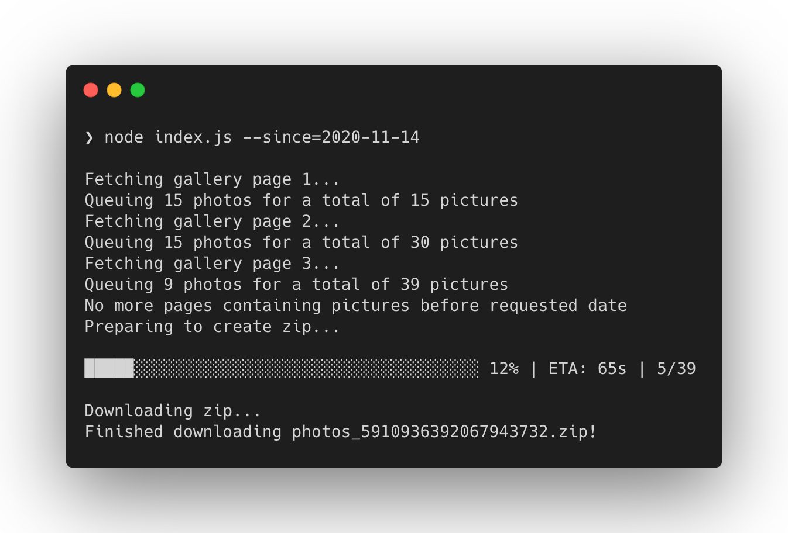

# Educabiz Gallery Downloader

## Introduction

[Educabiz](http://educabiz.com/) is a platform dedicated to nurseries, daycare centers, study centers and centers for extracurricular activities, allowing educators to share daily reports, plans of activities, assessments, communications and photos with the community (parents and other loved ones).

One of the best aspects of this platform is that I am able to record and appreciate memories of my kid growing up as most of her time is spent in the daycare center.

Unfortunately, downloading each picture individually is a tedious process and the web interface limits the amount of photos that can be downloaded at the same time. It would take me hours to go through this process.

A partial (second) confinement due to Covid-19 came into force on the 4th of November of 2020 in Portugal in 121 municipalities where there was a high risk of transmission. I decided to use some of the time to build this mass photo downloader.

## Installation

Clone this repository and run yarn (or npm install) to install its dependencies.

```sh
❯ git clone https://github.com/ruimarinho/educabiz-gallery-downloader
❯ cd educabiz-gallery-downloader
❯ yarn
```

## Usage

You will typically access your institution via a URL like `https://<subdomain>.educabiz.com` - this is your `EDUCABIZ_SLUG`.

Login and once you land on the dashboard, view source. Search for `childId` and you will find this HTML field:

```html
<input type="hidden" name="childId" value="0000000">
```

Grab that `value`. This is your `EDUCABIZ_CHILD_ID`.

Prepend (or export) this config as environment variables and run `index.js`:

```sh
❯ EDUCABIZ_SLUG="<subdomain>" EDUCABIZ_CHILD_ID="<childId>" EDUCABIZ_USERNAME="<email>" EDUCABIZ_PASSWORD="<password>" node index.js
```



Optionally, for incremental downloads, you may specificy an argument with a date since when you would like to download photos for (e.g. `--since=2020-11-14`).

The output will be a zipped file with all available pictures.

## License

MIT
